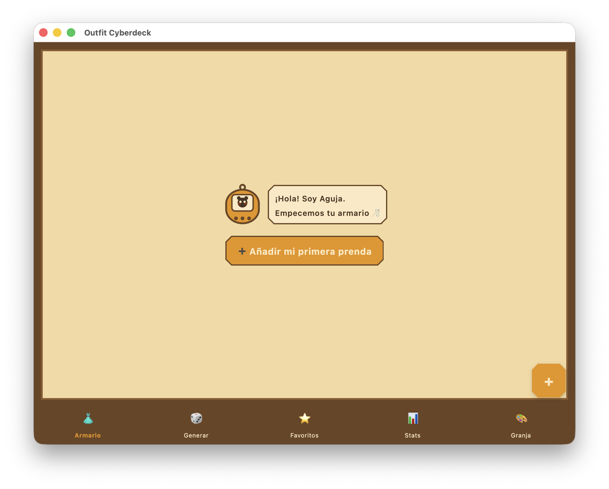
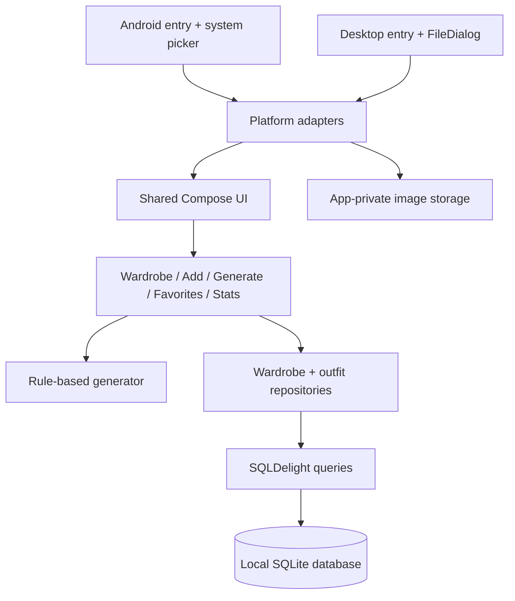

<h1 align="center">Outfit Cyberdeck</h1>

<p align="center"><strong>Your wardrobe as a private, local-first character creator.</strong></p>

<p align="center">
  A Kotlin Multiplatform wardrobe that turns manual clothing classification into<br>
  a playful pixel-art workflow and generates explainable combinations from your own collection.
</p>

<p align="center">
  <a href="https://github.com/JesusMonjeGonzalez/outfit-cyberdeck/actions/workflows/android.yml"></a>
  
  
  
  
</p>



<p align="center"><sub>Desktop target running with a clean temporary profile and no personal wardrobe data.</sub></p>

## The Workflow

1. Select an existing garment photo with the platform picker.
2. Classify it by category, type, fit, season, style and primary color.
3. Add at least one top and one bottom, then generate compatible combinations.

The app copies selected images into application-controlled storage, so a saved
garment does not depend on the original gallery file remaining in place.

## Features

- Shared Compose Multiplatform interface for Android and JVM Desktop.
- Six garment categories: tops, bottoms, footwear, outerwear, accessories and bags.
- Search by type, category or style plus category filters.
- Garment detail and deletion.
- Rule-based outfit generation with optional style and season preferences.
- Saved favorite outfits and wardrobe statistics.
- Runtime `Granja` and `Kawaii` visual palettes.
- Original animated mascot and pixel controls drawn with Compose Canvas.
- SQLDelight persistence with no backend, account or analytics service.

The interface is currently Spanish-first.

## How Generation Works

The generator uses explicit, inspectable rules rather than a remote model:

- Requested season and style filter the available wardrobe.
- `TODO_EL_AÑO` garments satisfy every season preference.
- Style matching uses a small compatibility map.
- A top and bottom are required.
- Footwear, outerwear, bag and accessory are optional.
- Eligible garments are selected randomly, so repeated generations can vary.
- Saved favorites store references to their constituent garments.

Color is stored and shown in statistics, but color harmony is not yet part of
the generation algorithm.

## Architecture



```text
composeApp/src/commonMain/   shared UI, domain, repositories and SQLDelight schema
composeApp/src/androidMain/  Android activity, picker, image storage and SQLite driver
composeApp/src/desktopMain/  desktop window, FileDialog, storage and JDBC driver
```

The project intentionally uses a compact architecture: local screen state,
repositories exposing SQLDelight flows, and small platform adapters. There is
no backend, dependency-injection framework or separate navigation runtime.

## Requirements

- JDK 17.
- Included Gradle wrapper; no global Gradle installation required.
- Android SDK API 35 for Android builds.
- Android 8.0/API 26 or newer on device.
- `ANDROID_HOME` or an ignored `local.properties` containing `sdk.dir=...`.

## Run On Android

```bash
git clone https://github.com/JesusMonjeGonzalez/outfit-cyberdeck.git
cd outfit-cyberdeck
./gradlew :composeApp:assembleDebug
```

The APK is generated at:

```text
composeApp/build/outputs/apk/debug/composeApp-debug.apk
```

Install and launch on a connected device or emulator:

```bash
./gradlew :composeApp:installDebug
adb shell am start -n com.tinacyberdeck.outfit/.MainActivity
```

The manifest requests neither gallery-wide access nor Internet access. Image
selection uses the system document picker.

## Run On Desktop

```bash
./gradlew :composeApp:run
```

Desktop data is stored under:

```text
~/.outfit-cyberdeck/outfit_cyberdeck.db
~/.outfit-cyberdeck/garments/
```

## Local Data And Privacy

- No account, backend, synchronization, telemetry or analytics.
- Android stores the database and copied images in app-private storage.
- Uninstalling the Android app removes that local data unless the platform restores a backup; Android backup is disabled in the manifest.
- Desktop data remains under `~/.outfit-cyberdeck/` until removed manually.
- No personal database or garment photo is committed to this repository.

## Project Status

Preview-quality application with successful Android and Desktop builds. The
repository does not yet contain an automated test suite, so GitHub CI verifies
Android compilation rather than runtime behavior.

Known gaps:

- Garments cannot be edited after creation.
- No direct camera capture, import/export, backup or device sync.
- Theme selection is not persisted.
- Deleting a garment does not yet remove its copied image file.
- Generator failure does not explain which required category is missing.
- No published APK, desktop installer or compatibility matrix.

## Next Steps

1. Seeded generator and SQLDelight repository tests.
2. Garment editing and copied-image lifecycle cleanup.
3. Export/backup and packaged preview releases.
4. Compose UI checks for narrow layouts and accessibility.

See [`DESIGN.md`](DESIGN.md) for the visual system and component conventions.
